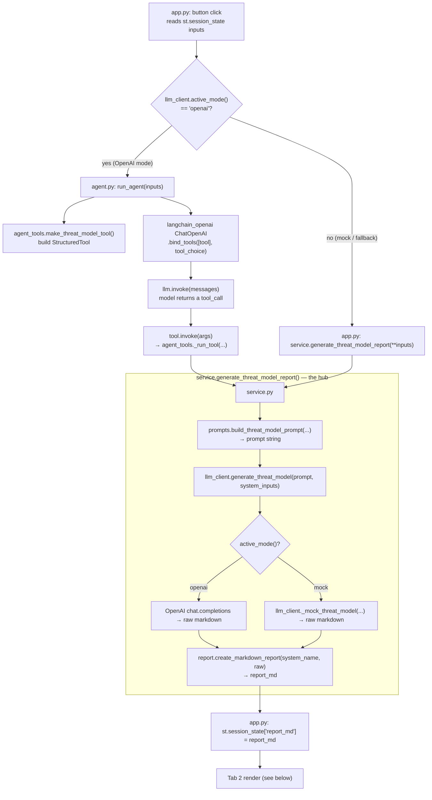
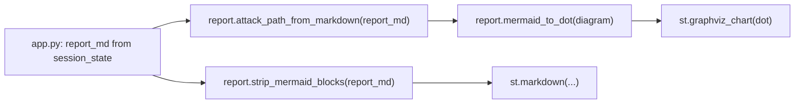
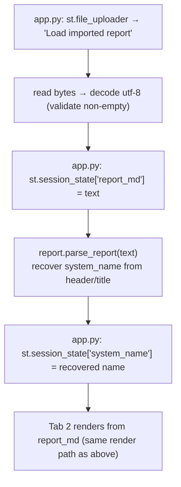
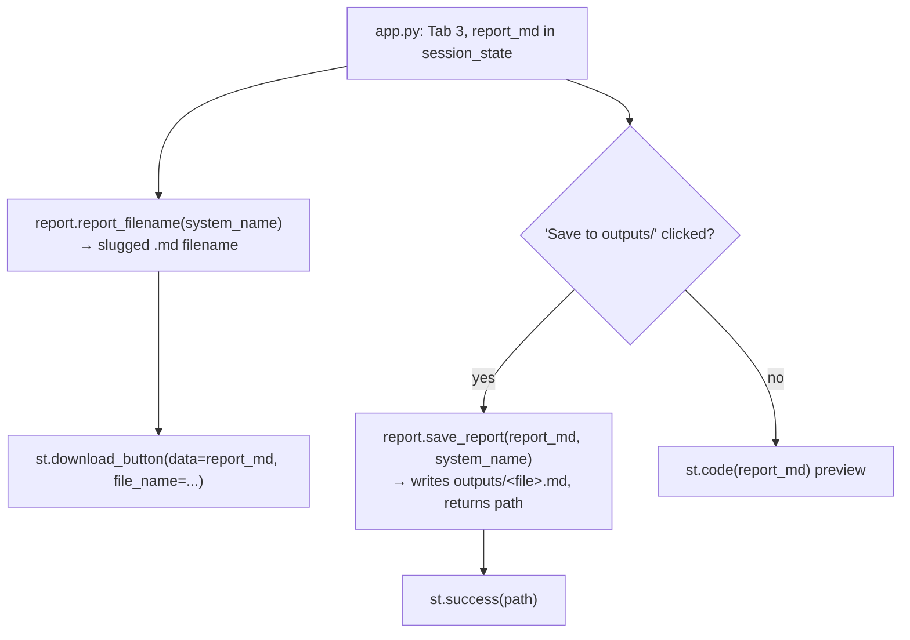

# Code Flow — AI Threat Modeling Assistant

How control moves across the files for each user action. Notation: `file::function`.

## File responsibilities

| File | Role | Key functions |
|------|------|---------------|
| `app.py` | Streamlit UI + state; orchestrates everything | button/upload/export handlers |
| `threat_model/agent.py` | LangChain **tool calling** (OpenAI mode) | `run_agent()` |
| `threat_model/agent_tools.py` | Defines the tool the model calls | `make_threat_model_tool()`, `_run_tool()` |
| `threat_model/service.py` | Single API method (the hub) | `generate_threat_model_report()` |
| `threat_model/prompts.py` | Builds the LLM instruction | `build_threat_model_prompt()` |
| `threat_model/llm_client.py` | OpenAI call or offline mock; mode detect | `active_mode()`, `generate_threat_model()`, `_mock_threat_model()` |
| `threat_model/report.py` | Assemble / parse / export / diagram | `create_markdown_report()`, `attack_path_from_markdown()`, `mermaid_to_dot()`, `strip_mermaid_blocks()`, `parse_report()`, `report_filename()`, `save_report()` |

The **hub** is `service.generate_threat_model_report()` — both the tool and the
mock-mode fallback funnel through it, and it always does
`prompts → llm_client → report`.

---

## 1. "🚀 Generate Threat Model" button (Tab 1)



**Walkthrough**
1. `app.py` reads the form fields from `st.session_state` (validates `description`).
2. `llm_client.active_mode()` decides the path.
3. **OpenAI mode:** `agent.run_agent(inputs)` →
   - `agent_tools.make_threat_model_tool()` builds the `generate_threat_model` tool,
   - `ChatOpenAI.bind_tools(...).invoke(...)` → model emits a tool call,
   - `tool.invoke(args)` → `agent_tools._run_tool(...)` → **`service.generate_threat_model_report(...)`**.
   - If the model didn't call the tool, or the agent errors, `app.py` falls back to calling the service directly.
4. **Mock mode:** `app.py` calls `service.generate_threat_model_report(**inputs)` directly.
5. **Hub** (`service.py`): in OpenAI mode it first calls
   `references.retrieve_reference_context(description)` (ChromaDB book search) and
   passes it to `prompts.build_threat_model_prompt(..., reference_context=...)`;
   then `llm_client.generate_threat_model()` (OpenAI **or** `_mock_threat_model`) →
   `report.create_markdown_report()` → returns `report_md`. (Reference grounding is
   best-effort and skipped in mock mode.)
6. `app.py` stores `report_md` in session state.

> Note: in OpenAI mode there are **two** model calls — one for the agent to choose
> the tool, one inside `generate_threat_model` to write the report.

### Tab 2 rendering (after generation or import)

`report.attack_path_from_markdown()` → `report.mermaid_to_dot()` → `st.graphviz_chart`
draws the diagram; `report.strip_mermaid_blocks()` removes the raw fenced block so
`st.markdown` shows the body cleanly.

---

## 2. "📥 Import a saved report (.md)" (Tab 1 expander)



**Walkthrough**
1. `app.py` reads the uploaded `.md`, decodes UTF-8, checks it isn't empty.
2. Stores the text straight into `st.session_state['report_md']` (no generation).
3. `report.parse_report(text)` recovers the system name from the report's metadata
   table / title; `app.py` repopulates the `system_name` field.
4. Tab 2 renders it via the **same** `report.py` diagram/markdown path as Flow 1.
   (Import touches **only** `app.py` + `report.parse_report` — no `service`/`agent`/`prompts`/`llm_client`.)

---

## 3. "⬇️ Download" / "💾 Save to outputs/" (Tab 3 — Export)



**Walkthrough**
1. `report.report_filename(system_name)` builds a slugged filename; `st.download_button`
   serves `report_md` for download.
2. If **Save to outputs/** is clicked, `report.save_report(report_md, system_name)`
   writes the file and returns its path (shown via `st.success`).
   (Export touches **only** `app.py` + `report.report_filename` / `report.save_report`.)

---

## One-line summary

```
Generate : app.py → [openai] agent.run_agent → agent_tools tool → service ┐
                   → [mock]   service ──────────────────────────────────┘→ prompts → llm_client → report → session → Tab 2 render(report.*)
Import   : app.py (upload) → report.parse_report → session → Tab 2 render(report.*)
Export   : app.py (Tab 3) → report.report_filename / report.save_report
```
